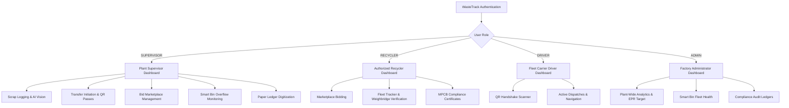
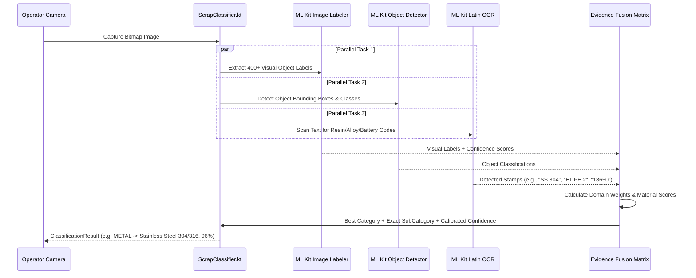
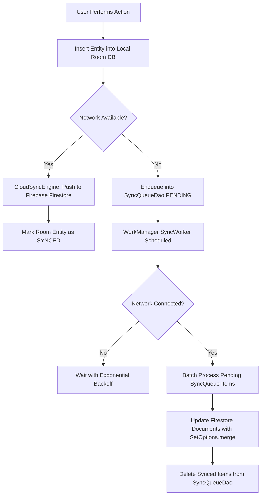
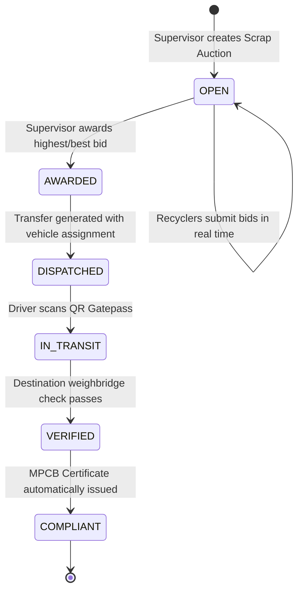

# ♻️ WasteTrack — Industrial Circular Economy Operating System

[-3DDC84?style=for-the-badge&logo=android&logoColor=white)](https://developer.android.com)
[](https://kotlinlang.org)
[](https://developer.android.com/jetpack/compose)
[](https://developer.android.com/topic/architecture)
[](https://developer.android.com/training/data-storage/room)
[](https://dagger.dev/hilt/)
[](https://developers.google.com/ml-kit)
[](https://github.com/sumitborse63/wastetrack)
[](https://github.com/sumitborse63/wastetrack)

> **WasteTrack** is an enterprise-grade, offline-first edge Android operating system designed to digitize, secure, and accelerate industrial scrap management and circular economy supply chains across MSME manufacturing hubs. Built with on-device Computer Vision, cryptographic audit trails, localized 24-hour micro-bidding, automated MPCB/ESG compliance reporting, and multilingual voice workflows.

---

## 📑 Table of Contents

1. [Executive Summary & Problem Context](#-executive-summary--problem-context)
2. [Key System Features](#-key-system-features)
3. [Role-Based Access & Dashboards](#-role-based-access--dashboards)
4. [System Architecture & Data Flows](#-system-architecture--data-flows)
5. [Edge AI & Computer Vision Pipeline](#-edge-ai--computer-vision-pipeline)
6. [Offline-First Sync Engine & Cryptographic Integrity](#-offline-first-sync-engine--cryptographic-integrity)
7. [Database Architecture & Entities](#-database-architecture--entities)
8. [Statutory ESG & MPCB Compliance Engine](#-statutory-esg--mpcb-compliance-engine)
9. [Localized B2B Scrap Micro-Bidding Marketplace](#-localized-b2b-scrap-micro-bidding-marketplace)
10. [Project Directory & File Structure](#-project-directory--file-structure)
11. [Technology Stack & Dependencies](#-technology-stack--dependencies)
12. [Environment Setup & Installation Guide](#-environment-setup--installation-guide)
13. [Build & Verification](#-build--verification)
14. [Security, Privacy & Biometrics](#-security-privacy--biometrics)
15. [Localization & Multilingual Accessibility](#-localization--multilingual-accessibility)
16. [License & Acknowledgements](#-license--acknowledgements)

---

## 🏭 Executive Summary & Problem Context

Industrial hubs and manufacturing corridors (such as the **Kopargaon Industrial Belt**, Ahmednagar district, and **Ambad MIDC**, Nashik) house thousands of micro, small, and medium manufacturing enterprises (MSMEs), agro-processing facilities, sugar & distillery byproduct units, engineering workshops, and fabrication plants. Despite generating tons of high-value industrial by-products (copper windings, stainless steel offcuts, engineering plastics, paper packaging, biomass residuals, spent solvents), operations suffer from severe operational friction:

1. **Archaic Paper Ledgers**: Factory scrap weights and classifications are recorded manually in paper logs, prone to human error, loss, and data tampering.
2. **Scrap Leakage & Fraud**: Weight discrepancies during dispatch (ballast addition, illicit diversion) result in substantial revenue losses.
3. **Regulatory Penalties (MPCB & EPR)**: Stringent statutory Extended Producer Responsibility (EPR) targets (up to 75% recycling traceability) and Maharashtra Pollution Control Board (MPCB Form 10) filings require immutable audit records.
4. **Sub-optimal Recycler Realization**: Opaque middleman cartels prevent factories from receiving fair market value for clean industrial scrap.
5. **Noisy Industrial Edge Environments**: Factory floors lack reliable high-speed internet, and operators wearing heavy PPE need hands-free, regional-language interaction.

**WasteTrack** solves these problems by providing an all-in-one mobile platform running directly on Android edge devices tailored for Kopargaon and regional Maharashtra MSME clusters.

---

## 🌟 Key System Features

### 1. 📷 Multi-Modal Edge AI Scrap Classifier
- **Zero-Typing Vision Logging**: Point the device camera at scrap piles or bins to automatically identify category and industrial sub-category with high confidence (85%–98%).
- **Multi-Modal Evidence Fusion**: Combines on-device ML Kit visual labeling, real-time object detection bounding boxes, and OCR text recognition (reading resin stamps like `PET 1`, alloy stamps like `SS 304`, battery chemistries like `Li-ion 18650`).
- **Offline TFLite Fallback**: Powered locally by `waste_classifier.tflite` and MobileNet quantized models without requiring internet access.

### 2. 🛡️ AI Fraud & Density Anomaly Shield
- **Ballast & Theft Detection**: Continuously verifies reported scrap weight against volumetric density bounds ($kg/m^3$) for each material category (e.g., metals: $400\text{–}1500\,kg/m^3$, plastics: $50\text{–}250\,kg/m^3$).
- **Live Anomaly Flagging**: Highlights suspicious loads in real time, preventing fraudulent weight inflation prior to gatepass generation.

### 3. 🤝 Cryptographic QR "Digital Handshake"
- **Dynamic Immutable Gatepasses**: On initiating scrap transfers, generates dynamic QR codes containing timestamped SHA-256 payload hashes (`id|scrapId|weight|supervisorId|timestamp`).
- **Driver Verification**: Logistics drivers scan the gatepass QR at the factory gate. The system enforces state transition (`INITIATED` $\rightarrow$ `QR_GENERATED` $\rightarrow$ `IN_TRANSIT`) with built-in QR expiration limits.

### 4. ⚖️ Weighbridge Destination Check & Discrepancy Dispute
- **Dual Weight Verification**: Recycler yards record arriving weighbridge weight.
- **Automated Discrepancy Detection**: Discrepancies exceeding $\pm 10\%$ flag the transfer as `DISPUTED` for audit investigation; valid deliveries are marked `VERIFIED` and trigger certificate generation.

### 5. 📜 Automated ESG & MPCB Form 10 Compliance Engine
- **Instant Digital Certificate Issuance**: Verified transfers automatically generate SHA-256 digitally signed MPCB Form 10 disposal certificates.
- **Native PDF Export**: Factory managers can generate and save official PDF compliance certificates to the device's Downloads directory with 1-tap.
- **Bulk Certificate Generation**: Batch-process uncertified completed transfers into verified records.

### 6. 🏪 24-Hour B2B Micro-Bidding Marketplace
- **Direct Scrap Auctions**: Factory supervisors post scrap lots with AI-suggested reserve pricing based on material market rates.
- **Real-Time Recycler Bidding**: Certified recycling partners place real-time competitive bids.
- **Atomic Award Flow**: Supervisors award the winning bid, which automatically instantiates an active transfer entity and prepares the dispatch gatepass.

### 7. ⏱️ Predictive "Zero-Overflow" Smart Bin Logistics
- **Continuous Fill-Rate Analytics**: Monitors smart bin capacity ($kg$) and percentage fill levels across factory scrap zones.
- **Deterministic ETA Forecasting**: Predicts exact time-to-full timestamps based on category-specific generation rates ($50\,kg/h$ for metal, $30\,kg/h$ for paper, etc.).
- **Urgent Dispatch Alerting**: Bins nearing $\ge 90\%$ capacity display an urgent dispatch banner directing supervisors to initiate a marketplace auction immediately.

### 8. 📄 NLP Legacy Paper Ledger Digitization
- **OCR Text Extraction**: Captures images of handwritten or printed paper ledgers using ML Kit Text Recognition.
- **Intelligent NLP Parsing**: Extracts scrap categories (Metal, Plastic, Paper, E-Waste, etc.) and numerical weights across units ($kg$, tons, $MT$).
- **1-Tap Bulk Migration**: Converts parsed ledger lines into structured `ScrapEntryEntity` records stored locally and queued for cloud sync.

### 9. 🎙️ Multilingual Regional Voice Logging
- **Hands-Free Operation**: Plant operators wearing heavy safety gloves can dictate scrap logs and notes via speech-to-text.
- **Regional Dialect Switcher**: Toggle seamlessly between **Marathi (`mr-IN`)**, **Hindi (`hi-IN`)**, and **English (`en-IN`)**.
- **Runtime Mic Permission Handling**: Built-in permission workflows with immediate visual feedback.

### 10. 🚚 Live Fleet & Logistics Tracker
- **Real-Time Telemetry & Progress**: Recyclers and drivers monitor active scrap shipments (`IN_TRANSIT`), route progression, ETA calculations, and vehicle numbers.
- **Driver Direct-Dial**: 1-tap phone dialer integration to contact logistics drivers on duty.

### 11. 🔐 Biometric Security Framework
- **Hardware-Backed Biometrics**: Integrated AndroidX `BiometricPrompt` supporting fingerprint and face authentication.
- **Gatepass Security Switch**: Optional security policy requiring biometric verification before authorizing scrap dispatches from the facility.

---

## 👥 Role-Based Access & Dashboards

WasteTrack dynamically adapts its navigation, bottom bar, and dashboard views based on the authenticated user's role:



### Role Matrix

| Capability | Plant Supervisor | Authorized Recycler | Fleet Driver | Factory Admin |
|---|:---:|:---:|:---:|:---:|
| **AI Scrap Vision Classification** | ✅ | ❌ | ❌ | ✅ |
| **Voice Scrap Logging** | ✅ | ❌ | ❌ | ✅ |
| **Legacy Ledger OCR Digitize** | ✅ | ❌ | ❌ | ✅ |
| **Generate QR Gatepass** | ✅ | ❌ | ❌ | ✅ |
| **Scan QR Gatepass** | ✅ | ❌ | ✅ | ❌ |
| **Create Auction Lot** | ✅ | ❌ | ❌ | ✅ |
| **Submit Marketplace Bids** | ❌ | ✅ | ❌ | ❌ |
| **Award Bids** | ✅ | ❌ | ❌ | ✅ |
| **Weighbridge Destination Verification** | ❌ | ✅ | ❌ | ❌ |
| **Generate MPCB Certificates & PDF** | ✅ | ✅ | ❌ | ✅ |
| **Smart Bin Predictive ETA** | ✅ | ❌ | ❌ | ✅ |
| **EPR Statutory Compliance Score** | ✅ | ❌ | ❌ | ✅ |

---

## 🏗️ System Architecture & Data Flows

WasteTrack adheres strictly to **Clean Architecture** and **MVVM** principles with unidirectional data flow (UDF) powered by Kotlin Coroutines and StateFlow:

```
┌─────────────────────────────────────────────────────────────┐
│                    Presentation Layer                       │
│    Jetpack Compose UI (Screens, Theme, Components, Nav)    │
│                            │                                │
│                     StateFlow / Events                      │
│                            ▼                                │
│                     ViewModels (AAC)                        │
└─────────────────────────────┬───────────────────────────────┘
                              │
┌─────────────────────────────▼───────────────────────────────┐
│                       Domain Layer                          │
│     UseCases (PredictOverflow, ClassifyScrap, Anomaly)      │
│     Domain Models (User, ScrapEntry, Transfer, Bin, Bid)    │
│     Repository Interfaces (IAuthRepository, IBidRepository) │
└─────────────────────────────┬───────────────────────────────┘
                              │
┌─────────────────────────────▼───────────────────────────────┐
│                        Data Layer                           │
│   ┌──────────────────────────────────────────────────────┐  │
│   │                 Local Storage (Room)                 │  │
│   │   WasteTrackDatabase (v2) + DAOs + Entities          │  │
│   └──────────────────────────┬───────────────────────────┘  │
│                              │                              │
│   ┌──────────────────────────▼───────────────────────────┐  │
│   │               Offline-First Sync Engine              │  │
│   │   SyncQueueDao ──► SyncWorker (WorkManager)          │  │
│   │           ▲                   │                      │  │
│   │           └────── CloudSyncEngine ◄──────────────┐   │  │
│   └──────────────────────────────────────────────────┼───┘  │
│                                                      │      │
│   ┌──────────────────────────┐  ┌────────────────────┴──┐   │
│   │        Edge AI/ML        │  │    Remote Services    │   │
│   │  TFLite + ML Kit Vision  │  │  Firebase Firestore   │   │
│   │  OCR + Volume Estimator  │  │  Auth + FCM Messaging │   │
│   └──────────────────────────┘  └───────────────────────┘   │
└─────────────────────────────────────────────────────────────┘
```

---

## 🧠 Edge AI & Computer Vision Pipeline

The on-device classification engine (`ScrapClassifier.kt`) employs a **Multi-Modal Weighted Evidence Fusion** algorithm to determine the material category and specific industrial subcategory without sending images to external clouds:



### Material Categories Supported

1. **🔩 Metal**: Copper Wire/Cable, Aluminum Ingot/Extrusion, Brass Scrap, Heavy Melting Steel (HMS), Stainless Steel (304/316), Cast Iron, Lead/Battery Plates, Zinc Scrap, Mild Steel Sheets.
2. **♻️ Plastic**: PET Bottles & Sheets, HDPE Drums & Containers, PVC Pipes & Sheaths, LDPE Film & Wrap, PP Moulded Scrap, ABS Electronic Casings.
3. **⚫ Rubber**: Tire Shreds/Whole Tires, Conveyor Belting, Industrial Hoses & Seals, Synthetic Rubber Scrap.
4. **💻 E-Waste**: Printed Circuit Boards (PCB), Li-ion/Lead-Acid Batteries, Hard Drives & Server Racks, Copper Coils & Transformers, Display Panels & Monitors.
5. **⚗️ Chemical**: Spent Solvent/Oil, Acidic/Alkaline Residue, Paint & Sludge Scrap, Industrial Coolant.
6. **🪵 Wood**: Wooden Pallets, Sawdust & Shavings, Plywood & MDF Offcuts, Untreated Timber Scrap.
7. **📄 Paper**: Corrugated Cardboard (OCC), Office White Paper Shreds, Newsprint Scrap, Kraft Paper Rolls.
8. **🪟 Glass**: Clear Cullet Glass, Amber/Green Bottles, Laminated Window Glass, Laboratory Glassware.
9. **📦 Other**: Textiles & Fabric Rags, Mixed Solid Scrap, Construction Debris, Refuse Derived Fuel (RDF).

---

## 🔄 Offline-First Sync Engine & Cryptographic Integrity

WasteTrack functions 100% offline. Factory basements and remote scrap yards do not require active network connections to create logs, execute QR gatepasses, or predict bin overflows.



### Cryptographic Audit Integrity

Every critical transactional entity is hashed using standard **SHA-256** to prevent retroactive ledger manipulation:

- **Scrap Log Content Hash**:
  $$\text{Hash} = \text{SHA256}(\text{id} \parallel \text{category} \parallel \text{weightKg} \parallel \text{factoryId} \parallel \text{timestamp})$$
- **Transfer Content Hash**:
  $$\text{Hash} = \text{SHA256}(\text{id} \parallel \text{scrapEntryId} \parallel \text{weightAtSource} \parallel \text{supervisorId} \parallel \text{timestamp})$$
- **Certificate Signature**:
  $$\text{DigitalSignature} = \text{SHA256}(\text{jsonPayload})$$

---

## 🗄️ Database Architecture & Entities

The SQLite database is managed via Android **Room Database (version 2)** with exported KSP schemas:

```
WasteTrackDatabase (v2)
├── scrap_entries (ScrapEntryEntity)
├── transfers (TransferEntity)
├── certificates (CertificateEntity)
├── bid_requests (BidRequestEntity)
├── bids (BidEntity)
├── smart_bins (BinEntity)
├── qr_handshakes (QRHandshakeEntity)
├── sync_queue (SyncQueueEntity)
└── users (UserEntity)
```

### Entity Fields Summary

| Entity | Primary Key | Key Attributes | Sync Status Support |
|---|---|---|:---:|
| `ScrapEntryEntity` | `id: String` | `factoryId`, `category`, `subCategory`, `weightKg`, `anomalyScore`, `anomalyFlagged`, `contentHash`, `createdAt` | ✅ |
| `TransferEntity` | `id: String` | `scrapEntryId`, `fromFactoryId`, `toRecyclerId`, `weightAtSource`, `weightAtDestination`, `vehicleNumber`, `status`, `contentHash` | ✅ |
| `CertificateEntity` | `id: String` | `transferId`, `factoryId`, `type`, `jsonPayload`, `digitalSignature`, `status`, `generatedAt` | ✅ |
| `BidRequestEntity` | `id: String` | `factoryId`, `scrapCategory`, `estimatedWeightKg`, `reservePricePerKg`, `auctionStartTime`, `auctionEndTime`, `status` | ✅ |
| `BidEntity` | `id: String` | `bidRequestId`, `recyclerId`, `recyclerName`, `pricePerKg`, `totalBidAmount`, `isWinning`, `submittedAt` | ✅ |
| `BinEntity` | `id: String` | `factoryId`, `scrapCategory`, `capacityKg`, `currentFillKg`, `fillPercentage`, `predictedFullTimestamp`, `status` | ✅ |
| `QRHandshakeEntity` | `id: String` | `transferId`, `qrPayload`, `supervisorSignature`, `driverSignature`, `isValid`, `generatedAt`, `scannedAt` | ❌ |
| `SyncQueueEntity` | `id: Long` (auto) | `entityType`, `entityId`, `action`, `payload`, `retryCount`, `createdAt` | — |
| `UserEntity` | `id: String` | `name`, `phone`, `role`, `organizationName`, `factoryId`, `industrialArea`, `registrationNumber` | ✅ |

---

## 📋 Statutory ESG & MPCB Compliance Engine

Under the Maharashtra Pollution Control Board (MPCB) and Central Pollution Control Board (CPCB) guidelines, industrial hazardous and non-hazardous scrap dispatches require verified manifests.

### MPCB Form 10 JSON Payload Specification

```json
{
  "certificateId": "c4b3a120-7f5b-4a21-8ecb-99d9b626487e",
  "type": "MPCB_DISPOSAL",
  "factoryId": "ambad-midc-pilot-001",
  "factoryName": "Ambad MIDC Pilot Manufacturing Plant",
  "mpcbRegNumber": "MPCB/MH/NAS/2024/001234",
  "transferId": "tf-84729-2024",
  "scrapEntryId": "sc-10293-2024",
  "weightDisposedKg": 450.0,
  "disposalMethod": "Certified Recycler Transfer",
  "vehicleNumber": "MH-15-TR-2024",
  "disposalDate": 1723680000000,
  "complianceOfficer": "Auto-Generated by WasteTrack",
  "verificationHash": "e3b0c44298fc1c149afbf4c8996fb92427ae41e4649b934ca495991b7852b855"
}
```

### PDF Exporter
The built-in `PdfExporter.kt` uses Android's native `android.graphics.pdf.PdfDocument` to render formal A4-sized compliance sheets and persists them directly into the public `Downloads` directory: `WasteTrack_Certificate_<id>.pdf`.

---

## 💰 Localized B2B Scrap Micro-Bidding Marketplace



### Benchmark Market Rates ($₹/kg$)
- **E-Waste**: $₹120/kg$
- **Chemical Scrap**: $₹80/kg$
- **Metal Scrap**: $₹45/kg$
- **Plastic Scrap**: $₹25/kg$
- **Paper / OCC**: $₹15/kg$
- **Rubber**: $₹12/kg$
- **Glass**: $₹10/kg$
- **Wood**: $₹8/kg$

---

## 📂 Project Directory & File Structure

```
wastetrack/
├── app/
│   ├── src/main/
│   │   ├── AndroidManifest.xml             # Permissions, application class, activities, services
│   │   ├── assets/
│   │   │   ├── waste_classifier.tflite     # Edge AI scrap classifier neural network
│   │   │   ├── mobilenet_v1_1.0_224_quant.tflite # Quantized vision backbone
│   │   │   └── labels_mobilenet_quant_v1_224.txt # Label taxonomy
│   │   ├── java/com/sktech/wastetrack/
│   │   │   ├── MainActivity.kt             # Single-activity Compose host with dynamic nav
│   │   │   ├── WasteTrackApp.kt            # Application entry point with Hilt & WorkManager init
│   │   │   ├── data/
│   │   │   │   ├── biometric/              # BiometricAuthManager & Preferences
│   │   │   │   ├── local/db/
│   │   │   │   │   ├── WasteTrackDatabase.kt # Room database definition (version 2)
│   │   │   │   │   ├── dao/                # 8 Room DAOs (Scrap, Transfer, Bid, Cert, Bin, etc.)
│   │   │   │   │   └── entity/             # 9 Room Entities
│   │   │   │   ├── ml/
│   │   │   │   │   ├── ScrapClassifier.kt  # Multi-modal Vision + OCR fusion classifier
│   │   │   │   │   ├── VolumeEstimator.kt  # Density & anti-fraud verification
│   │   │   │   │   └── OCRProcessor.kt     # ML Kit text recognition for ledgers
│   │   │   │   ├── remote/
│   │   │   │   │   ├── api/                # Retrofit APIs (MPCB, Honeywell telemetry)
│   │   │   │   │   └── firebase/           # FirebaseBidDataSource & Firestore connector
│   │   │   │   ├── repository/             # AuthRepositoryImpl, BidRepositoryImpl
│   │   │   │   └── sync/
│   │   │   │       └── CloudSyncEngine.kt  # Bi-directional Firestore & Room sync engine
│   │   │   ├── di/                         # Hilt Dependency Injection modules
│   │   │   ├── domain/
│   │   │   │   ├── model/                  # Domain POJOs, Enums (ScrapCategory, UserRole, etc.)
│   │   │   │   ├── repository/             # Repository contracts (IAuthRepository, IBidRepository)
│   │   │   │   └── usecase/                # PredictOverflowUseCase, ClassifyScrapUseCase
│   │   │   ├── service/
│   │   │   │   ├── MyFirebaseMessagingService.kt # FCM notification receiver
│   │   │   │   └── SyncWorker.kt           # Background Hilt CoroutineWorker for durable sync
│   │   │   ├── ui/
│   │   │   │   ├── biometric/              # Compose Biometric prompt launchers & UI
│   │   │   │   ├── components/             # Reusable UI widgets (VoiceInputButton, cards)
│   │   │   │   ├── navigation/             # NavGraph, Screen routes, BottomNavBar
│   │   │   │   ├── screens/
│   │   │   │   │   ├── analytics/          # AnalyticsScreen & ESG / EPR dashboard
│   │   │   │   │   ├── auth/               # LoginScreen, SignUpScreen, OTP flows
│   │   │   │   │   ├── bid/                # BidMarketScreen, BidDetailScreen
│   │   │   │   │   ├── bin/                # BinMonitorScreen (predictive overflow)
│   │   │   │   │   ├── compliance/         # ComplianceScreen (MPCB certs & PDF export)
│   │   │   │   │   ├── dashboard/          # Role-specific dashboards (Admin, Driver, Recycler, Supervisor)
│   │   │   │   │   ├── scrap/              # ScrapLogScreen, ScrapClassifyScreen, ScrapHistory
│   │   │   │   │   ├── settings/           # SettingsScreen, language switcher, profile editor
│   │   │   │   │   └── transfer/           # TransferScreen, QRScanScreen, FleetTrackerScreen
│   │   │   │   └── theme/                  # Color, Type, Shape, Theme (Emerald & Slate)
│   │   │   └── util/                       # HashUtils (SHA-256), PdfExporter, LocaleHelper, DateUtils
│   │   └── res/
│   │       ├── values/strings.xml          # English strings
│   │       ├── values-hi/strings.xml       # Hindi localization strings
│   │       └── values-mr/strings.xml       # Marathi localization strings
│   └── build.gradle.kts                    # App-level build config, SDK 35, dependencies
├── gradle/
│   └── libs.versions.toml                  # Version catalog
├── build.gradle.kts                        # Root build configuration
├── settings.gradle.kts                     # Gradle settings & plugin repositories
└── README.md                               # Master technical documentation
```

---

## 🛠️ Technology Stack & Dependencies

| Component | Technology | Version | Purpose |
|---|---|---|---|
| **Language** | Kotlin | `2.0.0` | Modern expressive type-safe Android development |
| **UI Framework** | Jetpack Compose (BOM) | `2024.06.00` | Declarative reactive UI system with Material 3 |
| **Target SDK** | Android 15 | `API 35` | Latest platform capabilities |
| **Minimum SDK** | Android 8.0 | `API 26` | Broad compatibility for industrial devices |
| **Dependency Injection** | Dagger Hilt | `2.51.1` | Compile-time dependency injection |
| **Local Database** | Room SQLite (KSP) | `2.7.1` | Offline-first reactive local database |
| **Background Sync** | WorkManager | `2.10.1` | Network-constrained persistent background synchronization |
| **Cloud Backend** | Firebase (Firestore, Auth, FCM) | `33.12.0` (BOM) | Real-time multi-device cloud synchronization |
| **On-Device Vision** | Google ML Kit | `17.0.9` | High-speed local image labeling & object detection |
| **On-Device OCR** | Google ML Kit Text Recognition | `16.0.1` | Fast Latin text OCR for marks, stamps, and paper ledgers |
| **Neural Execution** | TensorFlow Lite & Support | `2.16.1` / `0.4.4` | Pure offline TFLite classifier inference |
| **QR Code Engine** | ZXing Core | `3.5.3` | Gatepass QR generation & payload encoding |
| **Hardware Biometrics**| AndroidX Biometric | `1.1.0` | Secure fingerprint & facial biometric authentication |
| **Networking** | Retrofit 2 + OkHttp 3 | `2.11.0` / `4.12.0` | REST API communication & telemetry logging |
| **Image Loading** | Coil Compose | `2.6.0` | Asynchronous image loading with memory caching |

---

## 🚀 Environment Setup & Installation Guide

### Prerequisites
- **Android Studio Ladybug (2024.2.1+)** or newer.
- **Java Development Kit (JDK)**: Version 17.
- **Android SDK Platform**: API 35 with build tools `35.0.0`.
- Physical Android device or Emulator (API 26+) with camera and microphone access.

### Step-by-Step Installation

1. **Clone the Repository**:
   ```bash
   git clone https://github.com/sumitborse63/wastetrack.git
   cd wastetrack
   ```

2. **Configure `local.properties`**:
   Ensure your Android SDK path is specified in `local.properties`:
   ```properties
   sdk.dir=C\:\\Users\\<YourUsername>\\AppData\\Local\\Android\\Sdk
   ```

3. **Configure API Keys & Firebase (Optional for Cloud Sync)**:
   - Place your `google-services.json` file inside the `app/` directory.
   - (Optional) In `gradle.properties`, define custom API endpoints:
     ```properties
     WASTETRACK_API_BASE_URL=https://api.wastetrack.invalid/
     GEMINI_API_KEY=your_optional_gemini_api_key
     ```

4. **Build the Project**:
   ```bash
   ./gradlew clean assembleDebug
   ```

5. **Install on Device**:
   ```bash
   ./gradlew installDebug
   ```

---

## 🧪 Build & Verification

WasteTrack has been audited and compiles cleanly without errors.

```bash
# Run unit tests
./gradlew test

# Compile release APK with ProGuard minification & resource shrinking
./gradlew assembleRelease

# Check dependencies
./gradlew app:dependencies
```

### ProGuard & Optimization
Release builds are configured with `isMinifyEnabled = true` and `isShrinkResources = true` in [app/build.gradle.kts](file:///c:/Users/Sumit%20Borase/AndroidStudioProjects/wastetrack/app/build.gradle.kts) to ensure minimal APK footprint on field hardware.

---

## 🔒 Security, Privacy & Biometrics

- **Encrypted Local Cache**: User tokens and roles are securely cached in `SharedPreferences` and local Room database partitions.
- **Biometric Gatepass Safeguard**: Factory admins can enforce biometric authentication (`BiometricPreferencesManager.kt`) so that dispatches require physical supervisor authorization.
- **Zero Cloud Leakage for Edge ML**: Image labeling, OCR parsing, and density anomaly calculations happen completely on-device without streaming image files to external servers.

---

## 🌐 Localization & Multilingual Accessibility

WasteTrack offers full trilingual UI localization across all screens, headers, buttons, and error messages:

| Language | Locale Code | Supported Features |
|---|:---:|---|
| **English** | `en-IN` / `en` | Complete UI strings, PDF exports, and speech-to-text recognition |
| **हिंदी (Hindi)** | `hi-IN` / `hi` | Full localized strings in `values-hi/strings.xml`, voice input |
| **मराठी (Marathi)** | `mr-IN` / `mr` | Regional language optimization for Kopargaon, Ahmednagar & Maharashtra industrial hubs in `values-mr/strings.xml`, voice input |

---

## 🏆 License & Acknowledgements

Developed as part of **SKH (Smart Kopargaon Hackathon)**.

- **Team**: Astranyx
- **Target Industrial Pilot Zones**: 
  - **Kopargaon Industrial Belt & Agro-Manufacturing Cluster** (Ahmednagar District, Maharashtra, India) — Sugar & distillery byproducts, agricultural processing, packaging & fabrication scrap.
  - **Ambad MIDC Industrial Cluster** (Nashik, Maharashtra, India) — Automotive, electrical & engineering metals/plastics.
- **Regulatory Frameworks**: Maharashtra Pollution Control Board (MPCB) Hazardous & Solid Waste Management Rules, CPCB Extended Producer Responsibility (EPR) Guidelines.


---

<div align="center">
  <sub>Built with ❤️ for a cleaner, circular industrial future.</sub>
</div>
